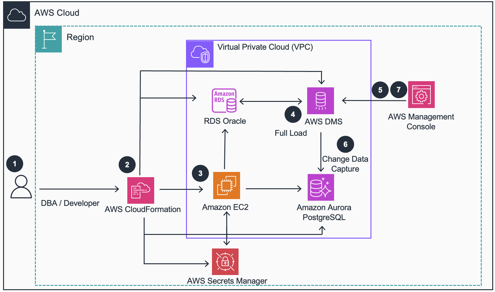

## Guidance for Oracle Migrations to Amazon Aurora PostgreSQL using AWS DMS 

## Table of Contents

List the top-level sections of the README template, along with a hyperlink to the specific section.

1. [Overview](#overview)
    - [Cost](#cost)
2. [Prerequisites](#prerequisites)
    - [Operating System](#operating-system)
3. [Deployment Steps](#deployment-steps)
4. [Deployment Validation](#deployment-validation)
5. [Running the Guidance](#running-the-guidance)
6. [Next Steps](#next-steps)
7. [Cleanup](#cleanup)

***Optional***

8. [FAQ, known issues, additional considerations, and limitations](#faq-known-issues-additional-considerations-and-limitations)
9. [Revisions](#revisions)
10. [Notices](#notices)
11. [Authors](#authors)

## Overview

This guidance demonstrates how to efficiently migrate very large tables from Oracle to Amazon Aurora PostgreSQL. The guidance leverages multiple DMS tasks that have been preconfigured for high performance for both the full load and CDC stages of the migration. Users can further tune DMS parameters for their particular workload, but this provides a very good starting point for large databases. Included sample code contains a Cloudformation template that builds out the entire environment, including the Oracle database, DMS Infrastructure, DMS tasks, and Aurora PostgreSQL database.




### Cost

You are responsible for the cost of the AWS services used while running this Guidance.

As of 09/09/2024, the cost for running this guidance with the default settings in the US-West-2 (Oregon) is approximately $19,596.97 per month.

The cloudformation template takes inputs on the size of instances used, so this can be scaled up or down as needed. It also does not need to be run for a full month to understand the guidance and apply it to your particular workload. This could easily be run for just a few days and to understand the potential performance and parallel tuning possibilities and then deleted. After you spin this up, you can lwoer the instance sizes when you aren't using it. 

We recommend creating a Budget and *budget alarm* through AWS Cost Explorer to help manage costs. Prices are subject to change. For full details, refer to the pricing webpage for each AWS service used in this Guidance.

The following table provides a sample cost breakdown for deploying this Guidance with the default parameters in the US-West-2 (Oregon) Region for one month.

| AWS service  | Dimensions | Monthly Cost [USD] |
| ----------- | ------------ | ------------ |
| Amazon RDS for Oracle | r6i.16xl and 5 TB Storage | $6,017.88 |
| Amazon Aurora PostgreSQL | r6g.16xl and 5 TB Storage | $6,575.61 |
| DMS Replication Instance | r6i.16xl and 1 TB Storage | $5,326.11 | 
| Amazon EC2 | m5.xl | $130.75 | 

## Prerequisites 

- Access to deploy Cloudformation template and create resources (Amazon EC2, Aurora PostgreSQL, RDS Oracle, VPC, Subnets, Security groups, IAM roles and Policies). The solution leverages RDS Oracle with the BYOL option.  Customers are responsible for owning the appropriate amount of Oracle licenses. 

### Operating System 

- These deployment instructions are optimized to best work on **<Amazon Linux 2023 AMI>**, which is what the bastion host is running. 


### AWS account requirements 

This deployment requires that you have access to the following AWS services:

- Amazon RDS
- Amazon EC2
- Amazon S3
- Amazon VPC
- AWS IAM  
- AWS Cloudformation

### Supported Regions 

This guidance is supported in all AWS Regions


## Deployment Steps


1. Clone the repo using command
```
git clone https://github.com/aws-solutions-library-samples/guidance-for-large-data-migrations-from-oracle-to-amazon-aurora-postgresql
```

2. Deploy the Cloudformation template

    Using the AWS Management Console

    For this guidance, we will be using the us-west-2 region.
    Sign in to the AWS CloudFormation console.
   
    Click Create Stack and upload the oracletoaurorapgv13.yml file.
   
    Deploy the stack after entering dms-solution in the stack name.
        The parameters can be changed as desired but the solution has been tested and verified with the defaults.

## Deployment Validation
   
1. Open CloudFormation console and verify the status of the template with the name starting with dms-solution*.
   You should also see an Oracle and Aurora PostgreSQL database under the RDS section of the management console.

   


## Running the Guidance

1. Login to the EC2 instance using Systems Manager (EC2 page -> Connect -> SSM)
   
2. Change Directory

```
cd /home/dms
```

3. Install git

```
sudo yum install git -y
```

3. Clone the repo to the bastion host. We are using a Bastion to increase security since the database resides in a private VPC.
   
```
git clone https://github.com/aws-solutions-library-samples/guidance-for-large-data-migrations-from-oracle-to-amazon-aurora-postgresql
```

4. Configure the environment

```
sh export_variables.sh
```

5. Source environment variables

```
source ~/.bashrc
```

6. Configure Source DB

```
sh oracle_prerequisites_dms.sh
```

7. Change directory into the repo

```
cd guidance*
```

8. Connect to Oracle. Run the procedure to build the Schema and procedures.

```
sh /home/dms/oracle_connect.sh
```

```
@BuildAndLoadSchema.sql
```

9. Load some initial data while still connected to Oracle. This is configurable, more data will take longer to load. The procedure will complete quickly but schedules jobs in the background with DBMS_SCHEDULER. You can check status of the jobs with the query after the anonymous block below. The default settings will take at least a few hours to load over 1TB of data. If you want to load more data just be sure to increase the max storage size of the instance. 

```
BEGIN
        dms_sample.master_load_all(
            p_num_records => 50000000,         -- Total number of records to load
            p_commit_interval => 10000         -- Number of records after which to commit
        );
END;
    /
```

```
SELECT count(*)
FROM dba_scheduler_jobs
WHERE job_name LIKE '%LOAD%'
and state like '%RUNNING%';
```

10. You should now see significant load on the Oracle database (high CPU). The default settings will take a few hours to populate the tables. When finished let's see how much data we loaded. You can rerun the procedure to get your desired size dataset.

```
SELECT
    TABLE_NAME,
    ROUND(SUM(BYTES) / (1024 * 1024), 2) AS SIZE_MB
FROM
    (
        SELECT
            SEGMENT_NAME AS TABLE_NAME,
            BYTES
        FROM
            DBA_SEGMENTS
        WHERE
            OWNER = 'DMS_SAMPLE'
            AND SEGMENT_TYPE IN ('TABLE', 'TABLE PARTITION', 'TABLE SUBPARTITION')
    )
GROUP BY
    TABLE_NAME
ORDER BY
    SIZE_MB DESC
FETCH FIRST 30 ROWS ONLY;
```

11. Login to the DMS section of the AWS Console. Under Migration Tasks you will see 4 examples. The tasks are configured for optimal performance for each of the given scenarios:
    
| Task Name | Description |
| ---------- | ------------------------------------------------------------------------------------------------------------------------------------------------------------- |
| dms-solution-v*-nonparallelloadtables | This task will large load tables when parallelism isn't possible due to lack of partitioning or column to act as a boundary range. |
| dms-solution-v*-parallel-load-partitions-auto | This task will load large tables leveraging built in DMS parallelism capabilities against partitioned source tables. |
| dms-solution-v*-parallel-load-partitions-ranges | This task will load large tables leveraging boundary ranges when the table isn't partitioned. |
| dms-solution-v*-parallel-load-subpartitions-auto | This task will load large tables leveraging built in DMS parallelism capabilities against subpartitioned source tables. |

Run the task(s) of your choice and evaluate performance. In this guidance we have modified the **maxFileSize** and **maxFullLoadSubTasks** values to take advantage of the resources of the relatively large instances sizes we are using. These values can be further tuned for your specific workload, and to put more or less stress on the source database. Instance sizes can also be reduced or increased. If lowering the instance class of the DMS replication instance we recommend leaving the 1TB of storage for more IOPS and throughput of that EBS volume.

12. Choose one of the DMS tasks and run it. Multiple tasks could run in parallel but will affect performance. The tasks will bulk load the data into the target Aurora database. If you are interested in CDC, they are setup do that and you can execute another load of data on the source database (step 13).


## Next Steps

13. Monitor the DMS task performance in the AWS CloudWatch Console.


## Cleanup

Delete the Cloudformation stack will remove all resources. You may have to remove snapshots taken while the solution was running in order to delete the option group, as the snapshots will be associated with this option group.

## FAQ, known issues, additional considerations, and limitations


**Known issues**

Using maxFullLoadSubTasks value of 49 can lead to a race condition which may cause the task to fail. It is recommended to use a lower number of SubTasks (the default is 32). If you see this error: SQLite general error, Error: 'database is locked'> then try lowering the number of maxFullLoadSubTasks.


## Notices

*Customers are responsible for making their own independent assessment of the information in this Guidance. This Guidance: (a) is for informational purposes only, (b) represents AWS current product offerings and practices, which are subject to change without notice, and (c) does not create any commitments or assurances from AWS and its affiliates, suppliers or licensors. AWS products or services are provided “as is” without warranties, representations, or conditions of any kind, whether express or implied. AWS responsibilities and liabilities to its customers are controlled by AWS agreements, and this Guidance is not part of, nor does it modify, any agreement between AWS and its customers.*


## Authors 

Name of code contributors
