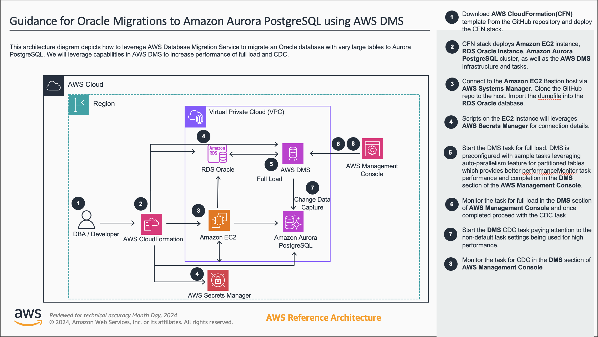
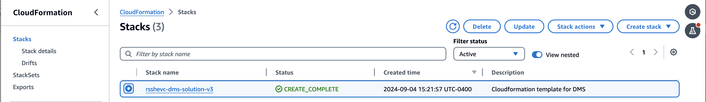

# Guidance for Oracle Migrations to Amazon Aurora PostgreSQL using AWS DMS 

## Table of Contents

List the top-level sections of the README template, along with a hyperlink to the specific section.

1. [Overview](#overview-required)
    - [Cost](#cost)
2. [Prerequisites](#prerequisites-required)
    - [Operating System](#operating-system-required)
3. [Deployment Steps](#deployment-steps-required)
4. [Deployment Validation](#deployment-validation-required)
5. [Running the Guidance](#running-the-guidance-required)
6. [Next Steps](#next-steps-required)
7. [Cleanup](#cleanup-required)

***Optional***

8. [FAQ, known issues, additional considerations, and limitations](#faq-known-issues-additional-considerations-and-limitations-optional)
9. [Revisions](#revisions-optional)
10. [Notices](#notices-optional)
11. [Authors](#authors-optional)

## Overview

This guidance demonstrates how to efficiently migrate very large tables from Oracle to Amazon Aurora PostgreSQL. The guidance leverages multiple DMS tasks that have been preconfigured for high performance for both the full load and CDC stages of the migration. Users can further tune DMS parameters for their particular workload, but this provides a very good starting point for large databases. Included sample code contains a Cloudformation template that builds out the entire environment, including the Oracle database, DMS Infrastructure, DMS tasks, and Aurora PostgreSQL database.




### Cost

You are responsible for the cost of the AWS services used while running this Guidance.

As of 09/09/2024, the cost for running this guidance with the default settings in the US-West-2 (Oregon) is approximately $19,596.97 per month.

The cloudformation template takes inputs on the size of instances used, so this can be scaled up or down as needed. It also does not need to be run for a full month to understand the guidance and apply it to your particular workload.

We recommend creating a Budget through AWS Cost Explorer to help manage costs. Prices are subject to change. For full details, refer to the pricing webpage for each AWS service used in this Guidance.

The following table provides a sample cost breakdown for deploying this Guidance with the default parameters in the US-West-2 (Oregon) Region for one month.

| AWS service  | Dimensions | Monthly Cost [USD] |
| ----------- | ------------ | ------------ |
| Amazon RDS for Oracle | 16.xl and 5 TB Storage | $6,017.88 |
| Amazon Aurora PostgreSQL | 16.xl and 5 TB Storage | $7,729.01 |
| DMS Replication Instance | 16.xl and 500 GB Storage | 5,326.11 | 
| Amazon EC2 | m5.4xl | 523.97 | 

## Prerequisites 

- Access to deploy Cloudformation template and create resources (Amazon EC2, Aurora PostgreSQL, RDS Oracle, VPC, Subnets, Security groups, IAM roles and Policies)

### Operating System 

- These deployment instructions are optimized to best work on **<Amazon Linux 2023 AMI>** but might work on any linux or Mac environment with little modification.


### AWS account requirements 

This deployment requires that you have access to the following AWS services:

- Amazon RDS
- Amazon EC2
- Amazon S3
- Amazon VPC
- AWS IAM  
- AWS Cloudformation

### Supported Regions 

This guidance is supported in all AWS Regions


## Deployment Steps


1. Deploy the Cloudformation template

    Using the AWS Management Console

    For this guidance, we will be using the us-west-2 region.
    Sign in to the AWS CloudFormation console
    Create Stack > Upload the oracletoaurorapgv*.yml file
    Deploy the stack after entering dms-solution in the stack name
        The parameters can be changed as desired but the solution has been tested and verified with the defaults.
2. Open CloudFormation console and verify the status of the template with the name starting with dms-solution-xxxxxx.
   You should also see an Oracle and Aurora PostgreSQL database under the RDS section of the management console.

   


## Running the Guidance (required)

1. Login to the EC2 instance using Systems Manager (EC2 page -> Connect -> SSM)
   
2. Switch user
```
sudo su - ec2-user
```
3. Install git
```
sudo dnf install git -y
```
4. Clone the repo using command (this may take a while)
```
git clone https://github.com/aws-solutions-library-samples/guidance-for-large-data-migrations-from-oracle-to-amazon-aurora-postgresql

```
5. Change Directory
```
cd /home/ec2-user
```
6. Download Oracle tools software
```
wget https://download.oracle.com/otn_software/linux/instantclient/2115000/instantclient-tools-linux.x64-21.15.0.0.0dbru.zip
```
7. Install unzip
```
sudo yum install unzip
```
8. Unzip software
```
unzip instantclient-tools-linux.x64-21.15.0.0.0dbru.zip
```
9. Add instant client to the PATH environmment variable
```
export PATH=$PATH:/home/ec2-user/instantclient_21_15/
```
10. Download the dump file to the RDS instance from S3
```
SELECT rdsadmin.rdsadmin_s3_tasks.download_from_s3(
p_bucket_name    =>  '<your-bucket-dms-solution',
p_directory_name =>  'DATA_PUMP_DIR'),
p_s3_prefix => '/'
AS TASK_ID FROM DUAL;
```
11. Create the tablespace to be used

```
cd /home/dms
```

```
sh oracle_connect.sh
```

```
@create_ts.sql

```

```
quit
```

13. Load the data (this will take ~6 hours with the defaults and loads ~1TB of data with the largest table having around ~700M records)

```
impdp ${SOURCEDBUSER}/${SOURCEDBPASSWORD}@${SOURCEDBHOST}:1521/dms dumpfile=dumpfilelargefile3.dmp SCHEMAS=dms_sample
```

12. Login to the DMS section of the AWS Console. Under Migration Tasks you will see 4 examples. The tasks are configured for optimal performance for each of the given scenarios
1/ not parallel loading a table 2/ parallel loading a partitioned table 3/ parallel loading a large table that isn't partitioned using boundary ranges and 4/ parallel loading a table with subpartitions (this is the largest table). Run the task(s) of your choice and evaluate performance. We discuss configuration settings in the next section.


## Next Steps (required)

In this guidance we have modified the maxFileSize and maxFullLoadSubTasks values to take advantage of the resources of the relatively large instances sizes we are using. These values can be further tuned for your specific workload, and to put more or less stress on the source database. Instance sizes can also be reduced or increased. If lowering the instance class of the DMS replication instance we recommend leaving the 1TB of storage for more IOPS and throughput of that volume. 


## Cleanup (required)

Delete the Cloudformation stack will remove all resources. 


## FAQ, known issues, additional considerations, and limitations (optional)


**Known issues (optional)**

<If there are common known issues, or errors that can occur during the Guidance deployment, describe the issue and resolution steps here>


**Additional considerations (if applicable)**

<Include considerations the customer must know while using the Guidance, such as anti-patterns, or billing considerations.>

**Examples:**

- “This Guidance creates a public AWS bucket required for the use-case.”
- “This Guidance created an Amazon SageMaker notebook that is billed per hour irrespective of usage.”
- “This Guidance creates unauthenticated public API endpoints.”


Provide a link to the *GitHub issues page* for users to provide feedback.


**Example:** *“For any feedback, questions, or suggestions, please use the issues tab under this repo.”*

## Revisions (optional)

Document all notable changes to this project.

Consider formatting this section based on Keep a Changelog, and adhering to Semantic Versioning.

## Notices (optional)

Include a legal disclaimer

**Example:**
*Customers are responsible for making their own independent assessment of the information in this Guidance. This Guidance: (a) is for informational purposes only, (b) represents AWS current product offerings and practices, which are subject to change without notice, and (c) does not create any commitments or assurances from AWS and its affiliates, suppliers or licensors. AWS products or services are provided “as is” without warranties, representations, or conditions of any kind, whether express or implied. AWS responsibilities and liabilities to its customers are controlled by AWS agreements, and this Guidance is not part of, nor does it modify, any agreement between AWS and its customers.*


## Authors (optional)

Name of code contributors
